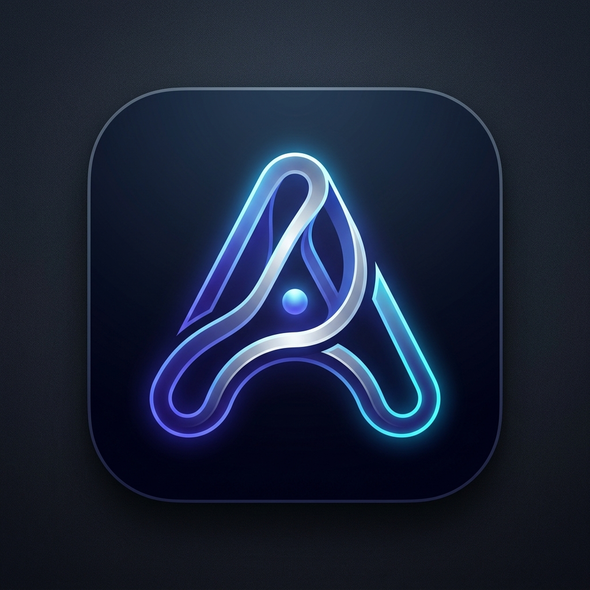

# 🌌 Antigravity Unified Platform

<p align="center">
  
</p>

<h3 align="center">Antigravity Connect Desktop Companion & iOS Mobile Client</h3>

<p align="center">
  
  
  
  
  
  
</p>

---

## 📖 Обзор проекта

**Antigravity Unified Platform** — это двухкомпонентная экосистема для локального инференса нейросетей на процессорах Intel и удаленного контроля автономного ИИ-агента Antigravity непосредственно с твоего iPhone.

1. **Connect Antigravity (ПК Компаньон)**: Десктоп-приложение на связке **Tauri (Rust) + Python (Flask)**. Выполняет роль локального AI-сервера и панели управления.
2. **Antigravity iOS (Мобильный клиент)**: Нативное iOS-приложение на **React Native (Expo)** в стиле системных настроек Apple. Позволяет управлять агентом, общаться, следить за файлами ПК и получать пуши о завершении задач.

---

## ✨ Основные возможности

### 💻 Connect Antigravity (Desktop)
* **Анализатор Видео YOLO**: Видео воспроизводится аппаратно силами браузера на 100% FPS, а координаты детекции (INT8/FP16 OpenVINO) накладываются асинхронно поверх через HTML5 Canvas. Поддерживает загрузку любых размеров моделей (`yolov8n.pt`, `yolo11s.pt`, YOLO-World).
* **Синтез Речи Silero v5.5**: Офлайн-генерация аудио с авто-ударениями и вопросительной интонацией. Обученная модель JIT загружается через `torch.package` напрямую на CPU и кэшируется в ОЗУ для инференса <100 мс.
* **Монитор Агента**: Анализирует процессы `antigravity-cli` и транскрипты `transcript.jsonl`. При изменении состояния с `RUNNING` на `FINISHED` отправляет нативное всплывающее уведомление Windows.
* **API Консоль**: Генерация/отзыв токенов `X-API-Key`, CORS-логирование в реальном времени и графики нагрузки (latency, concurrency).

### 📱 Antigravity iOS (Mobile)
* **Интерфейс в стиле Apple**: Сгруппированные таблицы, переключатели, нативные вкладки и SF-style иконки.
* **Файловый менеджер ПК**: Переход между папками твоего рабочего пространства на компьютере, просмотр файлов и инспекция изменений в реальном времени через встроенный `git diff`.
* **Удаленный чат**: Просмотр полного лога выполнения и транскриптов агента в реальном времени с возможностью отсылки команд.
* **Активные задачи & Shell**: Отслеживание фоновых под-агентов, просмотр stdout логов консоли ПК и прямая отправка команд в терминал компьютера.
* **Уведомления**: Bell-иконка в шапке с числом непрочитанных событий. Оповещает пушем, когда агент закончил выполнять код на ПК.

---

## 🛠 Установка и Запуск

### 1. Запуск десктопного бэкенда (ПК)
Убедись, что у тебя установлен Python 3.10+ и библиотеки `torch`, `ultralytics`, `openvino`, `flask`.

```bash
# Активация виртуального окружения
C:\Users\user\cat_env\Scripts\activate

# Запуск бэкенда
python app.py
```
Сервер будет доступен по адресу `http://localhost:5000` и готов принимать запросы со всех сетевых интерфейсов (`0.0.0.0:5000`).

### 2. Запуск Tauri Оболочки (ПК)
Для запуска десктопного приложения в режиме разработчика:
```bash
npm run tauri dev
```

### 3. Сборка мобильного клиента (iOS)
Сборка `.ipa` происходит автоматически в облаке через **GitHub Actions** при каждом пуше в ветки `main`/`master`.

* **Как установить на iPhone**:
  1. Зайди во вкладку **Actions** в этом репозитории.
  2. Выбери последний успешный запуск workflow **Build Sideloadable iOS App (IPA)**.
  3. Скачай артефакт **Antigravity-iOS-Sideload**.
  4. Распакуй архив, получив файл `Antigravity.ipa`.
  5. Установи его на телефон через **TrollStore, AltStore, SideStore** или **Scarlet** без необходимости иметь аккаунт Apple Developer!

* **Локальный запуск на iPhone (Expo Go)**:
  ```bash
  cd antigravity-ios
  npm install
  npx expo start
  ```
  Отсканируй QR-код камерой iPhone для запуска в приложении Expo Go. В настройках укажи IP адрес компьютера или туннель Cloudflare (`krnl-node`).

---

## ⚙️ Архитектура API

Компаньон предоставляет REST API для удаленного контроля (внешний доступ регулируется токеном `X-API-Key` в заголовке):

* `POST /api/detect` — Детекция объектов на переданном изображении/кадре.
* `POST /api/tts` — Генерация WAV-файла озвучки Silero v5.5 по переданному тексту.
* `GET /api/fs/list?path=...` — Получение содержимого папки на ПК.
* `GET /api/fs/read?path=...` — Чтение содержимого текстового файла.
* `GET /api/fs/diff` — Получение текущего `git diff` изменений в рабочей папке ПК.
* `POST /api/fs/cmd` — Выполнение shell-команды на ПК и возврат stdout/stderr.
* `GET /api/agy/transcript?conv_id=...` — Загрузка истории чата с ИИ-агентом.
* `POST /api/agy/send` — Передача сообщений/команд в очередь агента.

---

## 🛡 Лицензия
Проект распространяется под лицензией **MIT**. Разработано для удобного удаленного контроля ИИ-агентов.
